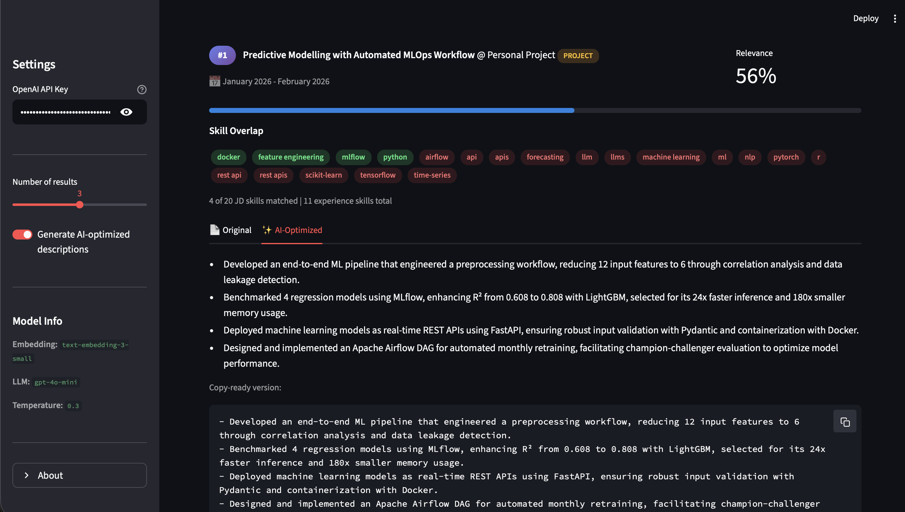

# AI-Powered Experience Matcher

**Semantically match your professional experiences to any job description using RAG.**




---

## Live Demo

The app is deployed on **Streamlit Cloud** and can be accessed at:

**[https://aiexperiencematcher.streamlit.app](https://aiexperiencematcher.streamlit.app)**

> **Note:** The experiences currently loaded are the author's own. A feature to upload your own experiences is coming soon.

---

## What It Does

AI Experience Matcher takes a job description and finds the most relevant experiences from your professional history using semantic vector search. It then uses GPT-4o-mini to rewrite each matched experience with tailored bullet points optimised for the target role. The result is a ranked list of your best-fit experiences with AI-generated descriptions **ready to paste** into your resume.

---

## Architecture

```
┌─────────────────────────────────────────────────────────────────┐
│                   Job Description                               │
└──────────────────────────┬──────────────────────────────────────┘
                           │
                           ▼
┌─────────────────────────────────────────────────────────────────┐
│              OpenAI Embedding (text-embedding-3-small)          │
│                      1536-dim vector                            │
└──────────────────────────┬──────────────────────────────────────┘
                           │
                           ▼
┌─────────────────────────────────────────────────────────────────┐
│                  FAISS Vector Search (<10ms)                    │
│               L2 distance → Top-K experiences                   │
└──────────────────────────┬──────────────────────────────────────┘
                           │
                           ▼
┌────────────────── Prallelized LLM API Call ─────────────────────┐
│                                                                 │
│  ┌──────────────┐ ┌──────────────┐ ┌──────────────┐             │
│  │  GPT-4o-mini │ │  GPT-4o-mini │ │  GPT-4o-mini │             │
│  │  Exp #1      │ │  Exp #2      │ │  Exp #3      │             │
│  │  Tailored    │ │  Tailored    │ │  Tailored    │             │
│  │  Bullets     │ │  Bullets     │ │  Bullets     │             │
│  └──────┬───────┘ └──────┬───────┘ └──────┬───────┘             │
│         │                │                │   ┌──────────────┐  │
│         │                │                │   │  GPT-4o-mini │  │
│         │                │                │   │  Fit         │  │
│         │                │                │   │  Analysis    │  │
│         │                │                │   └──────┬───────┘  │
│         ▼                ▼                ▼          ▼          │
│  ─ ─ ─ ─ ─ ─ ─ ─ ─ ─ asyncio.gather() ─ ─ ─ ─ ─ ─ ─ ─ ─ ─ ─ ─ ─ │
└──────────────────────────┬──────────────────────────────────────┘
                           │
                           ▼
┌─────────────────────────────────────────────────────────────────┐
│               Optimised Output (Streamlit UI / CLI)             │
│         Copy-ready bullets • Skill overlap • Export             │
└─────────────────────────────────────────────────────────────────┘
```

The pipeline follows a **Retrieval-Augmented Generation (RAG)** pattern:
1. **Embed** the job description using `text-embedding-3-small`
2. **Retrieve** the top-K most similar experiences via FAISS L2 search
3. **Generate** tailored descriptions and fit analysis using GPT-4o-mini

---

## Tech Stack

| Component         | Technology                          |
| ----------------- | ----------------------------------- |
| Embeddings        | OpenAI `text-embedding-3-small`     |
| Vector Store      | FAISS (Facebook AI Similarity Search) |
| LLM               | OpenAI `gpt-4o-mini`               |
| Orchestration     | LangChain                          |
| Frontend          | Streamlit                           |
| Language          | Python 3.9+                        |

---

## Quick Start

### 1. Clone the repository

```bash
git clone https://github.com/SmoKerYM/AI_Powered_Experience_Matcher.git
cd AI_Powered_Experience_Matcher
```

### 2. Create a virtual environment

```bash
python -m venv venv
source venv/bin/activate  # macOS/Linux
# venv\Scripts\activate   # Windows
```

### 3. Install dependencies

```bash
pip install -r requirements.txt
```

### 4. Set up your API key

```bash
cp .env.example .env
# Edit .env and add your OpenAI API key
```

### 5. Customise your experiences (optional)

Edit `data/experiences.json` with your own professional experiences, then rebuild the vector store:

```bash
rm -rf experience_vectorstore/
python run.py "any job description"
```

The vector store will be automatically rebuilt on the next run. After that, you can use the Streamlit UI or CLI as normal.

### 6. Run the app

**Streamlit UI (recommended):**
```bash
streamlit run app.py
```

**CLI:**
```bash
python run.py "Your job description here"
# or pipe from a file
cat job_description.txt | python run.py
```

---

## Project Structure

```
AI_Powered_Experience_Matcher/
├── data/
│   ├── experiences.json       # Your professional experiences
│   └── experiences.md         # Raw experience descriptions
├── demo/                      # Screenshots and demo media
├── src/
│   ├── __init__.py
│   ├── config.py              # Model and path constants
│   ├── matcher.py             # Core RAG pipeline (ExperienceMatcher)
│   └── prompts.py             # LLM prompt templates
├── tests/
│   ├── conftest.py            # Shared pytest fixtures
│   ├── test_data_integrity.py # Layer 1: data sanity (0 API calls)
│   ├── test_retrieval.py      # Layer 2: retrieval quality
│   ├── test_generation.py     # Layer 3: LLM output structure + LLM-as-judge
│   └── test_integration.py    # Layer 4: end-to-end pipeline
├── .env.example               # API key template
├── .github/workflows/
│   └── ci.yml                 # GitHub Actions CI/CD
├── .gitignore
├── LICENSE                    # MIT license
├── README.md
├── app.py                     # Streamlit web UI
├── pyproject.toml             # pytest configuration
├── requirements.txt           # Python dependencies
└── run.py                     # CLI tool
```

---

## How It Works

Traditional keyword matching misses the nuance of job descriptions. "Data analysis" and "business intelligence" mean similar things but share no words.

This tool solves that by converting both your experiences and the job description into **embedding vectors** — numerical representations that capture semantic meaning. Experiences are stored in a FAISS index for fast nearest-neighbour lookup.

When you submit a job description:
1. It gets embedded into the same vector space as your experiences
2. FAISS finds the closest matches by L2 distance (equivalent to cosine similarity for normalised vectors)
3. All LLM calls run **in parallel** using `asyncio.gather()` — 3 experience rewrites + 1 fit analysis fire concurrently
4. GPT-4o-mini rewrites bullet points to emphasise relevant skills while preserving your actual achievements
5. A fit analysis summarises your overall alignment with the role

---

## Testing

The project uses **pytest** with a 4-layer test suite and GitHub Actions CI/CD.

### Test structure

| Layer | File | API calls | What it tests |
|---|---|---|---|
| 1 | `test_data_integrity.py` | 0 | JSON schema, required fields, config values, prompt templates |
| 2 | `test_retrieval.py` | Embeddings | Search count, score range, ranking, relevance for known queries |
| 3 | `test_generation.py` | LLM | Bullet format, action verbs, skill references, LLM-as-a-judge |
| 4 | `test_integration.py` | Full pipeline | End-to-end structure, metadata, output quality |

### Run locally

```bash
# Fast tests only (no API key needed)
pytest tests/test_data_integrity.py -v

# All tests (requires OPENAI_API_KEY)
pytest tests/ -v
```

### CI/CD

GitHub Actions runs two jobs on every push to `main`:
- **fast-tests** — data integrity checks on every push and PR (~10s, free)
- **api-tests** — full suite on push to main only (~$0.01/run)

---

## Performance

| Metric              | Value             |
| ------------------- | ----------------- |
| Query time          | ~3-4s (async LLM)  |
| Cost per query      | ~$0.001           |
| Embedding model     | text-embedding-3-small (1536 dims) |
| LLM model           | gpt-4o-mini       |
| Vector search       | < 10ms (FAISS)    |

---

## Future Enhancements

- **Experience upload** — Allow users to upload their own experiences for personalised matching
- **Cover letter generation** — Auto-generate a cover letter from matched experiences
- **Skill gap analysis** — Identify missing skills and suggest learning resources
- **Multi-resume support** — Load multiple experience profiles for different career paths
- **PDF export** — Download results as a formatted PDF
- **Batch processing** — Analyse multiple job descriptions at once
- **Fine-tuned embeddings** — Train domain-specific embeddings for better matching

---

## Author

**Mingwei Yan**

[](https://github.com/SmoKerYM)
[](https://www.linkedin.com/in/mingwei-yan-my324/)

---

## Acknowledgements

Built with assistance from [Claude Code](https://claude.com/product/claude-code) (Claude Opus 4.6).

---

## License

This project is licensed under the MIT License — see the [LICENSE](LICENSE) file for details.
